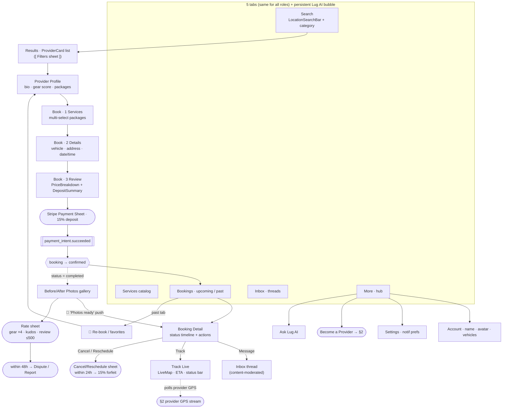
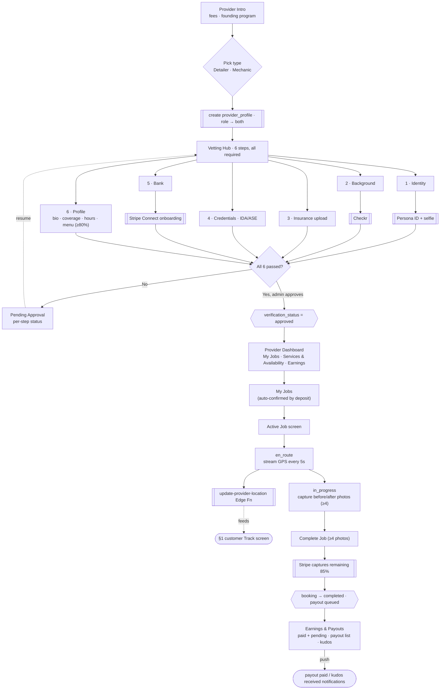

# CarApp — MVP User-Flow Wireframe (Idealized Target)

> **Design spec to build against.** This describes the *ideal* MVP UX for the
> Phase 1a launch (detailers, NoVA), not strictly what exists in code today.
> Nodes marked **🎯** are idealizations that go slightly beyond the current
> build — call them out in review if out of scope.
>
> Scope grounded in `CarApp_PRD_CoreVision_v5.docx` + [end_user_flows.md](end_user_flows.md).
> Diagrams render in GitHub / VS Code Markdown preview (Mermaid).
>
> **Shapes:** `[ Screen ]` · `{ Decision }` · `([ Modal/Sheet ])` · `[[ External service ]]`

---

## 0 · Shared Entry — Account creation & role choice

```mermaid
flowchart TD
    Splash["Splash · Get Started"] --> SignIn["Sign In<br/>Email/Phone OTP · Google · Apple"]

    SignIn -->|OTP| OtpEntry["OTP Entry"]
    OtpEntry --> OtpVerify["OTP Verify · 6-digit"]
    SignIn -->|Google / Apple| OAuth[["OAuth web sheet"]]

    OtpVerify --> Session{{"Supabase session"}}
    OAuth --> Session

    Session --> HasRow{"`users` row exists?"}
    HasRow -->|Yes| Returning(["Returning user → see §3 routing"])
    HasRow -->|No| Profile["1 · Profile<br/>full name + photo"]

    Profile --> Role["2 · Role selector<br/>Customer · Provider · Both<br/>(defaults to Customer)"]
    Role --> RoleBranch{Role?}

    RoleBranch -->|Customer / Both| Vehicle["3 · Add vehicle<br/>year · make · model · trim"]
    Vehicle --> Perms["🎯 Permission priming<br/>location + notifications"]
    Perms --> ReviewC["4 · Review & confirm"]
    ReviewC --> WriteC[["write users + vehicles rows"]]
    WriteC --> CustApp(["▶ §1 Customer app · Search tab"])

    RoleBranch -->|Provider only| ReviewP["Review & confirm<br/>(vehicle step skipped)"]
    ReviewP --> WriteP[["write users row (no vehicle)"]]
    WriteP --> Vetting(["▶ §2 Provider vetting"])
```

---

## 1 · Customer — Discover → Book → Track → Rate



---

## 2 · Provider — Vet → Approve → Work jobs → Get paid



---

## 3 · Returning user / cold-start routing

```mermaid
flowchart TD
    Start["App cold start"] --> GetSession{{"getSession"}}
    GetSession --> HasUser{"`users` row?"}
    HasUser -->|No| Onb(["§0 Onboarding"])
    HasUser -->|Yes| ProviderGate{"provider-only<br/>& NOT approved?"}
    ProviderGate -->|Yes| Pending["Pending Approval<br/>(resume vetting)"]
    ProviderGate -->|No| SearchTab["Search tab<br/>(Both users keep customer access)"]
```

---

## Decisions baked in — confirm during review

| # | Decision | Why |
|---|---|---|
| 1 | **One account, opt-in provider mode** | Single role fork at onboarding + "Become a Provider" later. `Both` users keep customer access while vetting. |
| 2 | **No provider accept/decline** | 15% deposit auto-confirms the booking; provider only drives the lifecycle forward. |
| 3 | **Identical 5 tabs for every role** | Provider tooling lives under the More tab, not separate tabs. |
| 4 | **MVP = Phase 1a (detailers, NoVA)** | Mechanics, recurring subscriptions, promo codes, and the admin web console are post-MVP. |
| 5 | **Lug AI persistent everywhere** | Floating bubble with a "Talk to a person" escalation into the inbox. |

### 🎯 Idealizations beyond today's build (flag if out of MVP scope)
- **Permission priming** for location + notifications during onboarding (today: requested ad-hoc).
- **"Photos ready" push** to the customer (today: deferred).
- **Re-book / favorites** entry from past bookings (today: "Book Again" pill only).
